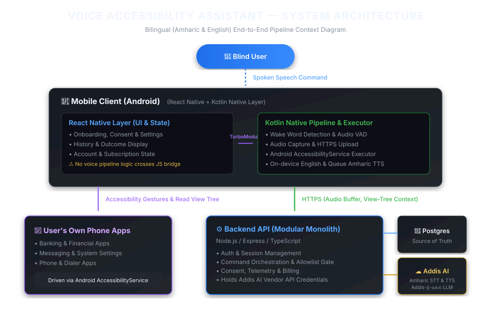

# EchoGuide

**A bilingual (Amharic and English) voice assistant that lets blind and low-vision users operate
the Android apps already on their phone.** The user speaks a command; EchoGuide transcribes it,
plans a sequence of on-screen actions, validates the plan, and performs it through Android's
accessibility service, speaking every outcome.



---

## How it works

```
Blind user ──speech──▶ Mobile client ──audio + screen context──▶ API ──▶ Addis AI (STT · LLM · TTS)
                       (RN UI + Kotlin pipeline)                  │
                              ▲                                   ├──▶ Postgres (source of truth)
                              └────── validated action plan ──────┘──▶ Redis (limits, queues)
```

1. **Capture (phone, Kotlin).** Wake word, voice activity detection, 16 kHz audio. Never streamed continuously.
2. **Transcribe and gate (API).** Addis AI speech-to-text, then a confidence gate before any planning call is spent.
3. **Plan and validate (API).** Addis AI plans actions against the current screen; the plan is checked against the contract and the user's per-app grants.
4. **Execute and speak (phone, Kotlin).** The plan is validated again on the device; destructive steps need a spoken "yes".

Design drivers: the executor must be native Kotlin (it drives other apps), every state must be
spoken (users cannot see the screen), and **no audio or transcript is stored by default**.

---

## Repository

npm workspaces + Turborepo.

| Path | What | Stack | Docs |
| --- | --- | --- | --- |
| [`apps/api`](apps/api) | Backend: auth, command pipeline, consent, billing, admin | Express, TypeScript, Drizzle, Postgres, Redis | [README](apps/api/README.md) |
| [`apps/mobile`](apps/mobile) | Android client: React Native UI + Kotlin voice pipeline and executor | Expo SDK 57, Kotlin | [architecture](apps/docs/src/content/docs/architecture/mobile-client.md) |
| [`apps/admin`](apps/admin) | Support portal (UI prototype; not yet wired to the API) | Next.js 14 | — |
| [`apps/docs`](apps/docs) | Documentation site and API reference | Astro + Starlight | [README](apps/docs/README.md) |
| [`packages/openapi`](packages/openapi) | **The API contract** — Zod schemas and TS types are generated from it | OpenAPI 3.0 | [ADR 003](docs/adr/003-openapi-contract.md) |
| [`packages/config`](packages/config) | Shared TypeScript config | — | — |
| [`docs/adr`](docs/adr) | Architecture decision records | — | — |
| [`docs/runbooks`](docs/runbooks) | Operational runbooks | — | — |

`apps/mobile` is not an npm workspace: it keeps its own lockfile and is installed separately.

---

## Getting started

**Prerequisites:** Node ≥ 20.11, npm ≥ 9, Docker, and the Android SDK (for the Kotlin layer).

```bash
# 1. Dependencies and the generated contract
npm install
npm run build --workspace=@echoguide/openapi

# 2. Postgres and Redis
docker compose up -d

# 3. API
cp apps/api/.env.example apps/api/.env      # then set AUTH_TOKEN_SECRET: openssl rand -hex 32
npm run db:migrate:dev --workspace=@echoguide/api
npm run start:api                            # http://localhost:4000

# 4. Mobile (separate terminal)
(cd apps/mobile && npm install)
npm run start:mobile
```

Then enable **Settings → Accessibility → EchoGuide** on the device. Android does not let an app
grant itself this permission, and without it nothing on screen can be touched.

Other apps: `npm run start:admin` (port 3001), `npm run start:docs`.

> If port 5432 or 6379 is already in use on your machine, change the host ports in
> `docker-compose.yml` and in `apps/api/.env`.

---

## Common tasks

| Task | Command |
| --- | --- |
| Build everything | `npm run build` |
| Test everything | `npm run test:infra:up --workspace=@echoguide/api && npm test` |
| Lint the API contract | `npm run lint` |
| Change the API contract | edit `packages/openapi/openapi.yaml`, then `npm run build --workspace=@echoguide/openapi` |
| New database migration | edit `apps/api/src/shared/database/schema.ts`, then `npm run db:generate --workspace=@echoguide/api` |
| Deploy the API | [`docs/runbooks/production-operations.md`](docs/runbooks/production-operations.md) |

---

## Architecture decisions

| ADR | Decision |
| --- | --- |
| [001](docs/adr/001-react-native-kotlin-split.md) | React Native shell, Kotlin pipeline; the pipeline never crosses the JS bridge |
| [002](docs/adr/002-modular-monolith.md) | Modular monolith over microservices |
| [003](docs/adr/003-openapi-contract.md) | OpenAPI YAML as the single contract source |
| [005](docs/adr/005-device-bound-opaque-sessions.md) | Opaque, device-bound sessions over JWT |

Decisions still to be recorded, the risk register and open questions are in the
[docs site](apps/docs/src/content/docs/architecture/decisions.md).

---

## Quality targets

| Attribute | Target |
| --- | --- |
| Time to first audio | p50 < 3.5 s, p95 < 6 s |
| Time to acknowledgement | < 400 ms |
| Command success rate | > 90% (English, at launch) |
| API availability | 99.5% monthly |
| Executor safety | **Zero** unintended destructive actions |

---

## Privacy

No audio or transcript is stored by default. Logs never contain what a user said, credentials or
phone hashes. Users can delete all their data (`DELETE /v1/consent/user-data`); deletion is
reported complete only once every copy is gone. Details:
[privacy](apps/docs/src/content/docs/reference/privacy.md).

---

## License

Internal proprietary — EchoGuide Team.
