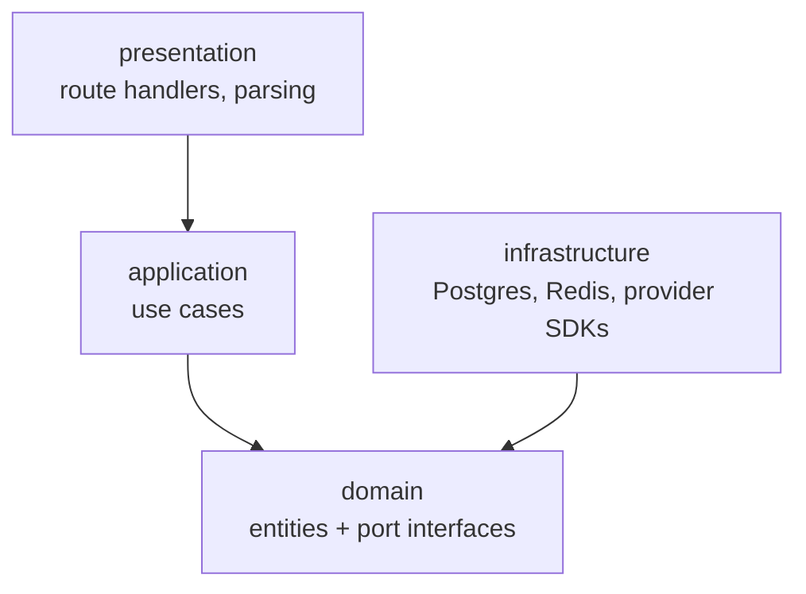
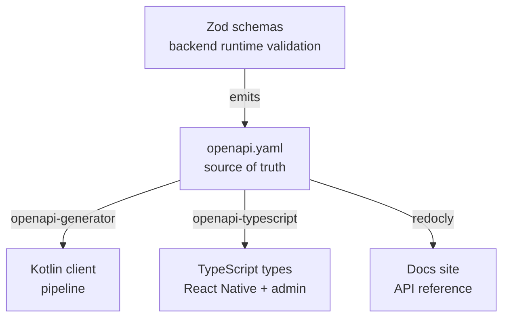

## Modular monolith

The backend is organised by business domain, never by technical layer. A `controllers/`,
`services/`, `models/` tree puts every unrelated feature into the same three folders and
guarantees they grow into each other.

```
apps/api/src/
├── modules/
│   ├── auth/          device registration, session issue and revoke
│   ├── users/         profile, language, voice preferences
│   ├── commands/      the pipeline: transcribe, gate, plan, validate
│   ├── vocabulary/    per-user prompt bias from contacts and installed apps
│   ├── consent/       retention grants, revocation, export, deletion
│   ├── telemetry/     structured events, aggregation, no transcripts
│   ├── billing/       subscription state, usage counters
│   └── admin/         support tooling, audit log, permission checks
├── shared/            database, cache, queue, logging, tracing, security
└── app/               routes, middleware, config, bootstrap
```

Nothing here has an independent scaling axis yet, so nothing is a separate service.
[Evolution](/architecture/evolution/#what-would-force-a-service-extraction) names the conditions
that would change that.

:::note[In the repository]
`apps/api/src/modules/` currently has `admin`, `auth`, `commands`, `consent`, `telemetry` and
`users`. `vocabulary` and `billing` are designed but not yet scaffolded.
:::

## The dependency rule

Each module has the same four layers, and dependencies point one way.



**Domain and application code never import Express, Postgres, or a provider SDK.** That is the
rule that earns the structure.

`TranscribeCommand` depends on a `TranscriptionPort` interface. `HostedTranscriptionAdapter`
implements it in `infrastructure/`. Moving transcription on-device later is then a one-file
change, not a rewrite.

Without the rule, these are four folders with architectural names and no architecture.

## Module boundaries

| Module | Owns | Must not |
| --- | --- | --- |
| `auth` | Device binding, session lifetime, token rotation | Know what a command is |
| `commands` | Confidence gate, plan validation, provider orchestration | Persist audio or transcripts |
| `vocabulary` | Building the bias prompt from user data | Send contact data to the planner |
| `consent` | Whether retention is permitted, right now | Be bypassed by any other module |
| `telemetry` | Counters, durations, outcomes | Accept a transcript and a user identifier together |
| `billing` | Entitlement checks, usage counters | Block a command on payment failure without spoken warning |
| `admin` | Support actions, every one audited | Read the database directly |

**Cross-module calls go through the owning module's application layer.** No module imports
another module's `infrastructure/` or queries its tables.

## Contracts

One schema, generated downward. The mobile client needs a Kotlin client for the pipeline and
TypeScript types for the React Native layer. A hand-written contract would be maintained three
times.



Validation and documentation come from one declaration. **A breaking change fails a client
build instead of reaching a user.**

:::caution[OpenAPI is not OpenAI]
OpenAPI is the schema format describing **this system's own API** to its own clients. Addis AI
is a vendor this system calls, and its endpoints happen to be OpenAI-compatible. That is a
portability property of the adapter, unrelated to how EchoGuide's API is described.
:::

The current contract is documented in the [API reference](/reference/api/).
