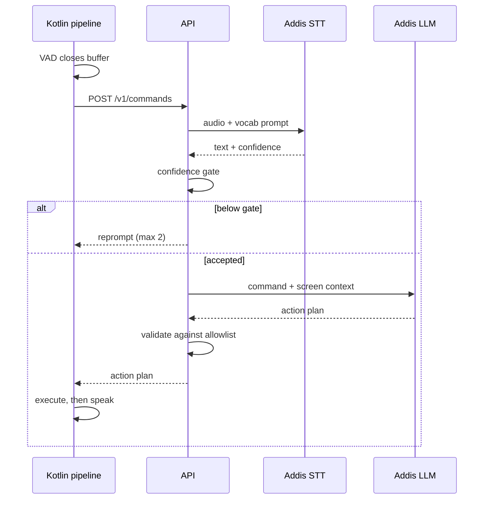
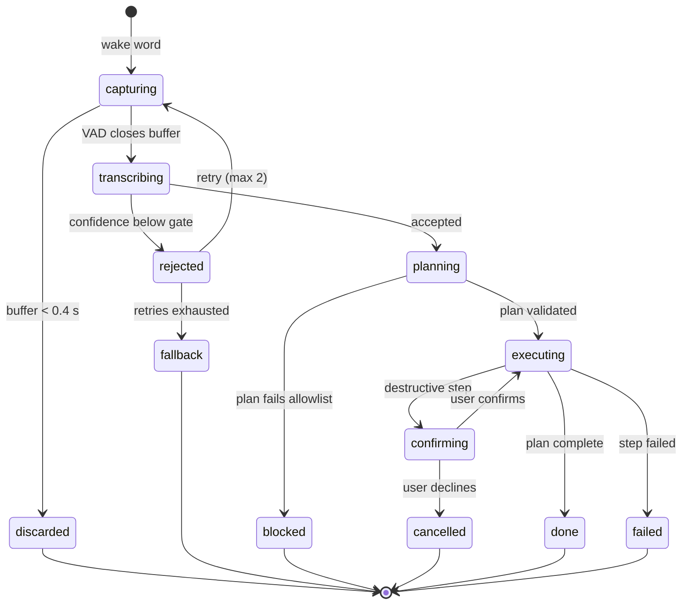

This is the only flow whose latency a user feels. Every step on the phone is Kotlin.

## One command, end to end

Two rules sit around this sequence:

- **A buffer shorter than 0.4 s never becomes a request.** The phone discards it as noise.
- **Two rejections, then a way out.** After two rejections the client offers on-screen input instead of asking a third time.

A blind user trapped in an endless "say that again" loop is the worst state this product can
reach.

## Capture parameters

| Parameter | Value | Reason |
| --- | --- | --- |
| Sample rate | 16 000 Hz | Native rate of the transcriber; higher is discarded |
| Channels | Mono | Stereo doubles the payload for no accuracy gain |
| Encoding | PCM 16-bit | Lossless capture, encoded before upload |
| Audio source | `VOICE_RECOGNITION` | Applies the device's speech-tuned processing |
| Minimum utterance | 0.4 s | Below this, treat as noise and send nothing |
| Maximum utterance | 15 s | Hard stop; a longer buffer means VAD failed |
| End-of-speech silence | 700 ms | Survives a mid-sentence pause, still feels responsive |

**Raw microphone audio is never streamed continuously.** VAD gates every request. Without it the
app uploads silence, burns data on a metered connection, and creates a privacy problem with no
defence.

## The confidence gate

The transcriber returns no confidence score. The backend derives one from what it does return,
and rejects **before** spending a planning call.

| Signal | Threshold | Meaning |
| --- | --- | --- |
| `avg_logprob` | Below −1.0 | The model was guessing |
| `no_speech_prob` | Above 0.6 | Probably not speech — reset silently |
| `compression_ratio` | Above 2.4 | Repetition loop, a known failure mode |

The surviving `avg_logprob` is mapped onto 0–1 and gated on. These thresholds are a starting
point to tune against real recordings, not a result.

:::caution[Schema mismatch]
`ConfidenceGateSchema` in `packages/openapi` declares `avg_logprob` with `.max(-1.0)`, which
accepts only values at or below −1.0. The design says below −1.0 means the model was guessing,
so the schema's direction is inverted. Treat the table above as the intent.
:::

## Speech output

Android's built-in synthesis has no dependable Amharic voice. The vendor's does, so the response
path splits by language.

| Language | Engine | Latency | Reason |
| --- | --- | --- | --- |
| English | On-device Android TTS | Near zero | Adequate quality, no network |
| Amharic | Addis AI TTS | Network round trip | The only path to a natural Amharic voice |

Amharic replies cost an extra round trip that English replies do not. Two mitigations keep it off
the critical path:

- **Pre-synthesise the fixed phrases.** Acknowledgements, the retry prompt, the confirmation question and every error line are a closed set. Synthesise them once, ship them with the app, refresh on language change.
- **Stream the variable remainder.** Only content the system could not predict — a message being read aloud — goes to the network. It starts playing on the first chunk, not on completion.

**The acknowledgement is instant in both languages.** That is what the 400 ms target actually
measures.

## Command lifecycle

Every command is a state machine, and **every terminal state produces speech**.

**`blocked` and `confirming` are safety states.** They exist because a planning model is
probabilistic and can drive a banking app. [Security](/architecture/security/) treats that as
the primary threat.

## How states map to the API

The API reports four statuses. The lifecycle above is richer because some states never leave the
phone.

| API status | Lifecycle state |
| --- | --- |
| `ACCEPTED` | `executing` |
| `CONFIRMATION_REQUIRED` | `confirming` |
| `REPROMPT` | `rejected` |
| `REJECTED` | `blocked` |

`discarded` never reaches the API. `done`, `failed` and `cancelled` happen on the phone after
the response. The full contract is in the [API reference](/reference/api/).
