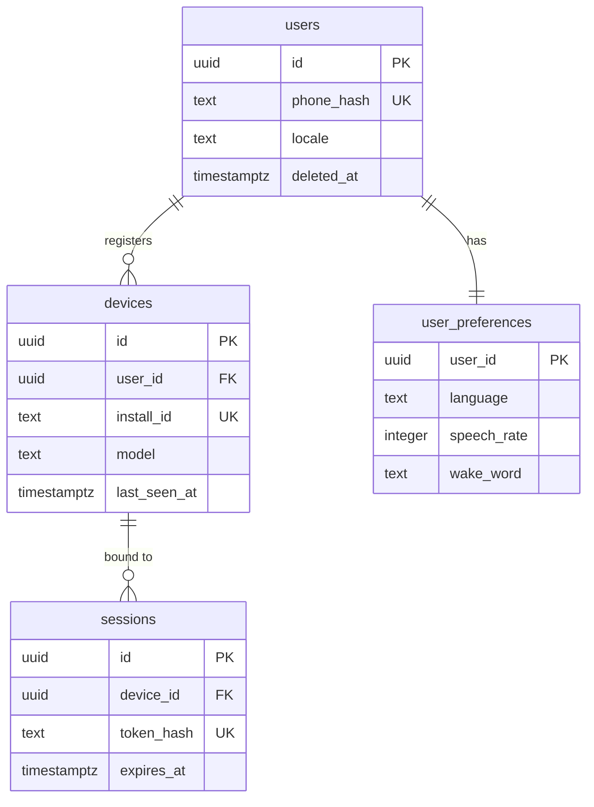
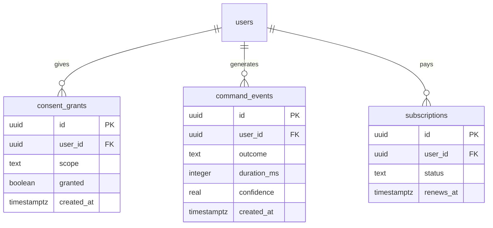

**Postgres is the source of truth.** Redis holds cache, rate limits and the job queue, and is
never authoritative.

## Identity and access



## Activity and consent



**There is no transcripts table and no audio table.** That is the design, not an omission.

Audio exists in memory for the duration of one request. Transcripts exist long enough to reach
the planner and are discarded with the request.

## `command_events` in detail

The only table with meaningful volume.

| Column | Type | Null | Notes |
| --- | --- | --- | --- |
| `id` | uuid | no | Also the request id, propagated to every log line |
| `user_id` | uuid | no | FK, cascade on user deletion |
| `outcome` | text | no | `done` · `failed` · `rejected` · `blocked` · `cancelled` |
| `duration_ms` | integer | no | End of speech to terminal state |
| `confidence` | real | yes | Null when the command never reached the gate |
| `stage_timings` | jsonb | no | Per-stage milliseconds for latency analysis |
| `created_at` | timestamptz | no | Partition key |

No transcript column, no audio reference, no app name. **The row records that a command
happened and how it went, never what was said.**

| Index | Columns | Serves |
| --- | --- | --- |
| `command_events_user_created_idx` | `(user_id, created_at desc)` | Per-user history |
| `command_events_created_idx` | `created_at` | Aggregation jobs |
| `command_events_outcome_idx` | `(outcome, created_at)` | Failure-rate dashboards |

## Growth and retention

At ten thousand users the table takes roughly nine million rows a month. Two decisions follow,
both cheaper now than later:

- **Partition monthly from the first migration.** Retro-partitioning a live table is a migration with downtime.
- **Keep 90 days of raw events**, then roll up to daily per-user aggregates and drop the partition. Detaching a partition is instant; deleting 27 million rows is not.

## Consent is append-only

`consent_grants` is never updated. Revocation writes a new row with `granted = false`. Current
state is the latest row per `(user_id, scope)`.

That costs one index and buys an auditable history of exactly what a user agreed to, and when.

## Deletion

```
DELETE users
  → devices, sessions, consent_grants,
    user_preferences, subscriptions, command_events   (CASCADE)
  → retained audio in object storage                  (job, not a cascade)
```

Object storage sits outside the transaction. Deletion enqueues a job, the job retries until the
objects are gone, and **the user is told deletion is complete only when it succeeds.**

:::note[In the repository]
The schema is defined with Drizzle in `apps/api/src/shared/database/schema.ts`. Migrations live in
`apps/api/drizzle/`, each with a matching rollback in `drizzle/down/`.

- `npm run db:migrate` applies pending migrations.
- `npm run db:rollback` reverts the latest one.
- `create_command_events_partition(date)` creates a month's partition, and is safe to call
  repeatedly. The first migration creates the current month and the next two, plus a default
  partition that catches rows if a month is ever missing.

Deleting a user cascades through every table in the database. The object-storage job is not built
yet, because audio retention does not exist yet.
:::
