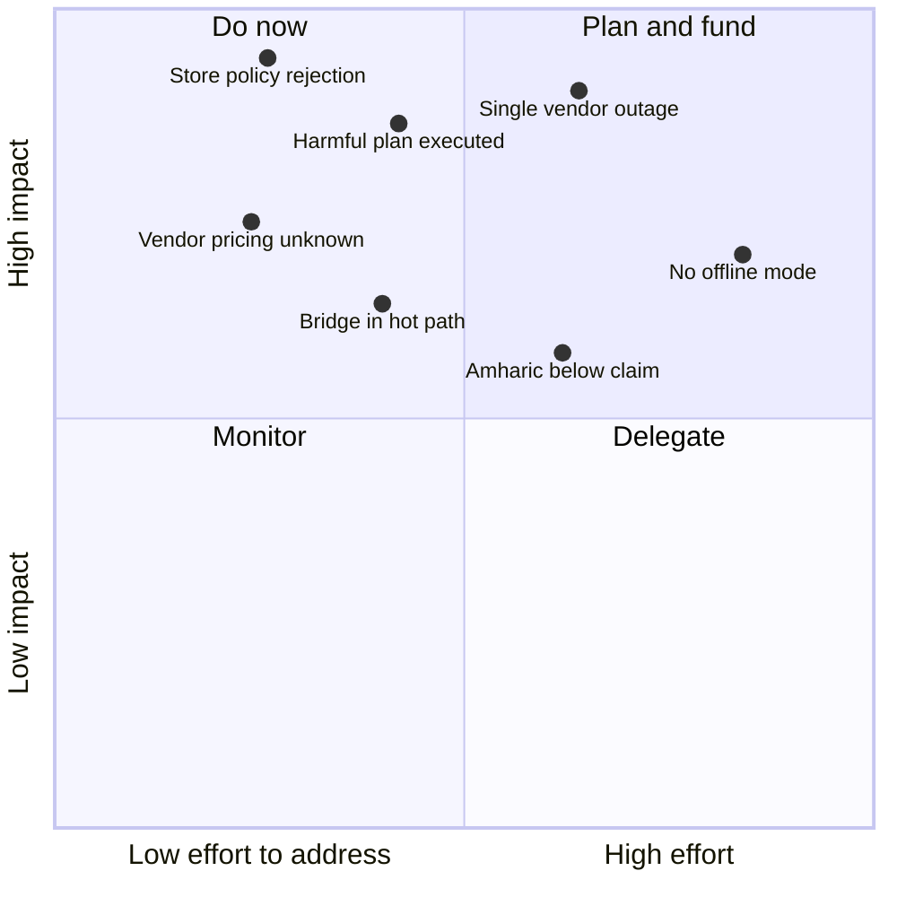

## Architecture decisions

Each needs its own ADR before implementation, because each is expensive to reverse.

| ADR | Decision | Blocking | Recorded |
| --- | --- | --- | --- |
| 001 | React Native shell with a Kotlin pipeline; the pipeline never crosses the bridge | Yes — first code written | Yes |
| 002 | Modular monolith over separate services | Yes | Yes |
| 003 | OpenAPI as the single contract source | Yes | Yes |
| 004 | Addis AI as the single voice vendor | Yes | No |
| 005 | Opaque device-bound sessions over JWT | Yes | No |
| 006 | No transcript or audio persistence by default | Yes | No |
| 007 | No over-the-air JavaScript bundle updates | Yes | No |
| 008 | Split speech output — device TTS for English, vendor for Amharic | Yes | No |
| 009 | Request-response at launch, duplex stream after measurement | Yes | No |
| 010 | Voxide on the docs site, deferred for the admin portal | No | No |
| 011 | Bilingual launch or English-only | Blocked on the Amharic corpus | No |

"Recorded" means an ADR file exists in `docs/adr/`. Today that is 001 to 003.

## Risk register

| Risk | Effort | Impact | Quadrant |
| --- | --- | --- | --- |
| Store policy rejection | Low | Very high | Do now |
| Harmful plan executed | Medium | Very high | Do now |
| Vendor pricing unknown | Low | High | Do now |
| Bridge in hot path | Medium | Medium | Do now |
| Single vendor outage | High | Very high | Plan and fund |
| No offline mode | Very high | High | Plan and fund |
| Amharic below claim | High | Medium | Plan and fund |

**Amharic accuracy dropped** from the top-right corner to the middle. A vendor built for the
language turns an open research question into a verification task.

**Single vendor outage rose sharply.** One account for transcription, planning and speech means
one incident removes all function. The mitigation is not a second vendor. It is honesty in the
failure path: pre-synthesised speech that works offline tells the user what is happening.

**Bridge in hot path is an erosion risk, not a defect.** It is the failure where a later feature
quietly moves a pipeline step into JavaScript for convenience. The instrumented pipeline test is
the control that catches it.

## Open decisions

| Decision | Blocks | Needed to resolve it |
| --- | --- | --- |
| Transcription and model pricing | The cost model, the subscription price | Vendor pricing for speech-to-text and `Addis-፩-አሌፍ` tokens |
| Wake-word engine | Battery disclosure, onboarding copy, cold-start target | Evaluate on-device engines against false-accept rate |
| Screen-context format | The planner prompt, injection surface, privacy review | Define the reduced view-tree schema and its size ceiling |
| Amharic accuracy in the field | ADR 011, bilingual launch | 200-utterance corpus from real users, verified against the 3% claim |
| Realtime beta readiness | ADR 009 timing | Vendor's stability and pricing for the duplex WebSocket |
| Retention scope | Consent copy, object storage design | Decide what accuracy-improvement retention actually stores |

**Vendor pricing is the largest unknown, and the cheapest to close.** It is one conversation, and
it decides whether the subscription price works.
