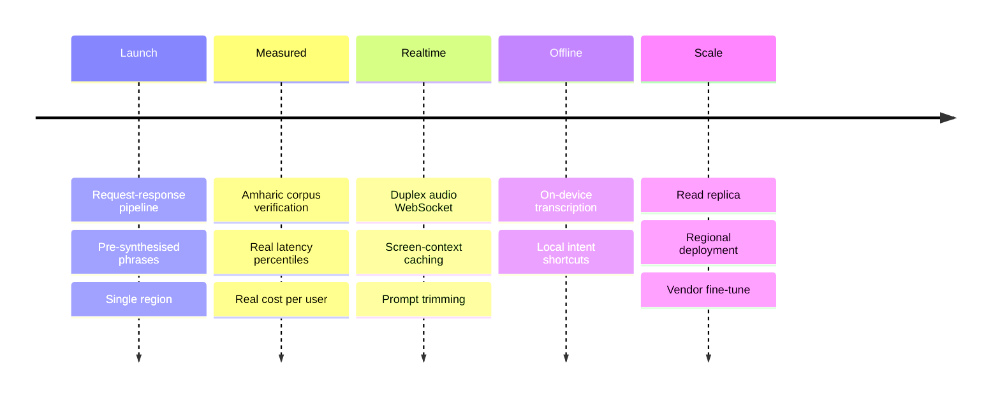

## Realtime is the big move

The vendor exposes speech in and speech out over a single WebSocket, in beta. Collapsing capture,
transcription, planning and synthesis into one duplex stream removes the sequential round trips
that make up most of the [5.8 s budget](/architecture/performance/#latency-budget).

**It is deliberately not the launch architecture.** A duplex stream replaces request-response
with a stateful connection. That changes the confidence gate, the failure table and the
idempotency model all at once.

Ship the boring version, measure it, then take the streaming win against a known baseline.

The [dependency rule](/architecture/backend/#the-dependency-rule) is what makes that a change of
adapter rather than a rewrite. This is the payoff for that rule.

## Honest partial offline

**Local intent shortcuts** are the honest path to partial offline. A small on-device classifier
handling the twenty most common commands covers most daily use without a local planning model.

Full offline needs a local planner, which is a different project.

## What would force a service extraction

Nothing today. Extract one module when one of these becomes true — not everything at once.

| Trigger | Extract |
| --- | --- |
| Transcription needs GPU instances | The transcription adapter, as a worker pool |
| Planning needs scaling independent of the API | The planner proxy |
| A second product reuses accounts | `auth` and `users` |
