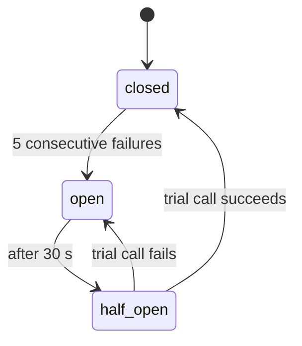

**Every failure produces speech.** To a user who cannot see the screen, silence is
indistinguishable from a crash.

## Failure table

| Failure | Detection | Degradation | User hears |
| --- | --- | --- | --- |
| Vendor down | 5xx or timeout | Total loss of function — one vendor serves all three services | "I can't reach the network right now" |
| Transcription slow | Over 8 s | Abort, do not queue | "That took too long. Try again" |
| Planning slow | Over 6 s | Abort after partial acknowledgement | "Still working", then failure |
| Amharic synthesis fails | 5xx or timeout | Fall back to on-device TTS | The reply, in a worse voice |
| Low confidence | `avg_logprob` under −1.0 | Reprompt, maximum 2 | "I think you said X — is that right?" |
| Not speech | `no_speech_prob` over 0.6 | Silent reset | Nothing, deliberately |
| Repetition loop | `compression_ratio` over 2.4 | Reject | "Could you say that again?" |
| Postgres down | Connection error | Sessions cannot be verified, so commands answer 503; telemetry stays buffered in Redis | "I can't reach the network right now" |
| Redis down | Connection error | No rate limiting, no idempotency de-duplication, telemetry dropped; deletion jobs still run from Postgres | Nothing; alert fires |
| Upstream rate limit | HTTP 429 | Back off, retry once | Speak only if the retry also fails |
| JavaScript context crashes | React Native error boundary | Pipeline unaffected; UI restarts | Nothing |

**The first row is the cost of one vendor.** Transcription, planning and Amharic speech share an
account, a rate limit and an outage. There is no partial service to degrade toward. Only the
pre-synthesised phrases still work — which is why the outage message is one of them.

**The last row is a dividend of the bridge rule.** A JavaScript crash is cosmetic because no part
of the pipeline depends on JavaScript.

## Two principles

- **Telemetry failure never breaks a user command.** Event writes are best-effort and buffered. A dashboard is not worth a blind user losing voice control of their phone.
- **Every upstream call has a hard timeout shorter than the user's patience.** Transcription 8 s, planning 6 s. A timeout is a defined outcome with defined speech, not an exception that bubbles up.

## Resilience mechanics

| Mechanism | Where | Setting |
| --- | --- | --- |
| Timeout | Every provider call | Transcribe 8 s, plan 6 s |
| Retry | Idempotent calls only | One retry, exponential backoff with jitter |
| Circuit breaker | Per provider | Open after 5 consecutive failures, half-open after 30 s |
| Idempotency key | `POST /v1/commands` | Client-generated; a retried upload never double-charges or double-executes |
| Bulkhead | Provider connection pools | Separate pools so a slow planner cannot starve transcription |

**Idempotency matters more than it looks.** A client retrying an upload over a flaky connection
must not be billed twice or perform an action twice.

## Runbook: vendor outage

From `docs/runbooks/vendor-outage-mitigation.md`.

**Detect.** Alert on provider error rate above 5%, or 5xx responses from `/v1/commands`.

1. **Check the vendor.** Confirm the outage on the vendor's status page.
2. **Confirm the fallback.** The client falls back to the pre-synthesised line "I can't reach the network right now".
3. **Check the breaker.** It should open after 5 consecutive failures and half-open after 30 s.
4. **Throttle.** Enable gateway rate limiting to prevent socket exhaustion.

What users hear during failures is also written up in plain language in
[What you will hear](/guides/what-you-hear/).
