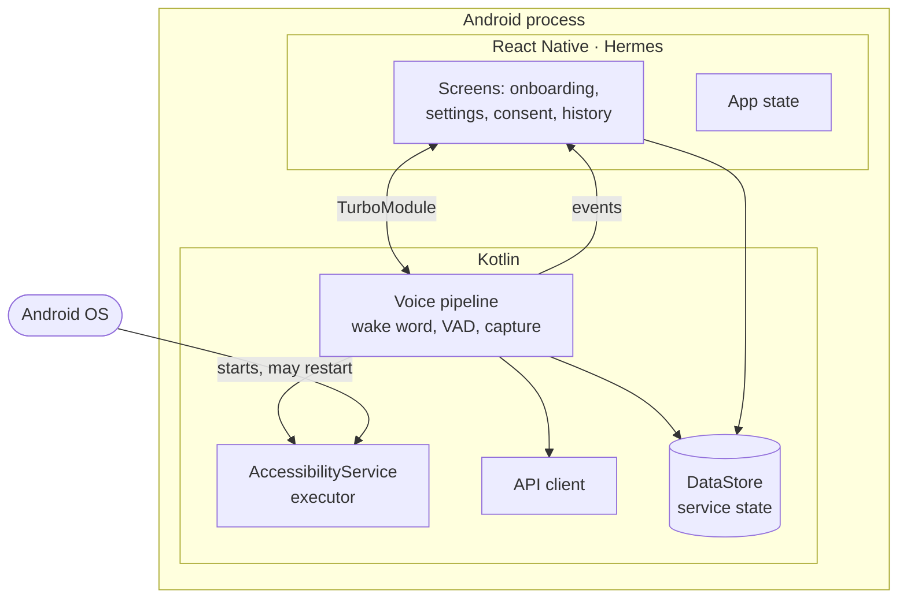

The client is a React Native app with a Kotlin native layer. The split is not cosmetic. It
follows one rule, and that rule decides whether the product works at all.

## The rule

> **The command pipeline never crosses the JavaScript bridge.**

Wake word, capture, voice activity detection, upload, plan execution and speech output are all
Kotlin. React Native owns screens, navigation, settings and account state.

**Why this is not a preference.** An `AccessibilityService` is a framework component declared in
the manifest and started by the operating system. It runs when the app's UI does not exist and
when the JavaScript runtime has been torn down.

A pipeline that depended on JavaScript would stop the moment the user left the app — which is
exactly when they need it.

## Process layout



**The operating system owns the executor's lifecycle, not the app.** So the Kotlin layer keeps
its own state of record in DataStore rather than in the JavaScript store. The UI reads that
state when it comes back.

## Who owns what

| Concern | Layer | Reason |
| --- | --- | --- |
| Onboarding, language choice, consent screens | React Native | Iteration speed on the screens that change most |
| Settings, history, account | React Native | Ordinary product UI, no latency budget |
| Wake-word detection | Kotlin | Always on, runs without a UI |
| Audio capture and VAD | Kotlin | `AudioRecord`, real time, cannot tolerate bridge latency |
| Command upload and retry | Kotlin | Must survive the UI being destroyed |
| Accessibility service and gesture dispatch | Kotlin | Framework component; no JavaScript equivalent exists |
| View-tree reduction | Kotlin | Runs per command, on the hot path |
| Text to speech | Kotlin | Must speak when no UI is present |
| Navigation and app state | React Native | Standard |

## The bridge contract

Three channels, each one-directional in intent, defined in one TurboModule specification.

| Channel | Direction | Carries | Frequency |
| --- | --- | --- | --- |
| Commands | JS → Kotlin | Start listening, stop, change language, revoke consent | User actions only |
| Events | Kotlin → JS | Pipeline state, last command outcome, microphone status | While the UI is foregrounded |
| Queries | JS → Kotlin | Current service state, permission status | On screen mount |

Four rules keep the bridge from becoming a liability:

- **Outcomes, never content.** No audio, no transcript and no action plan ever crosses the bridge.
- **Drop, don't queue.** Events are dropped when no UI is listening. A backlog of stale events on resume is worse than none.
- **Nothing blocks.** Every bridge call is fire-and-forget or has a timeout. A hung JavaScript context must never block the pipeline.
- **The spec is the contract.** The TurboModule specification is code-generated for both sides.

The bridge is also a security boundary — JavaScript can ask the pipeline to listen, never ask
the executor to act. See [Security](/architecture/security/#the-bridge-is-not-an-execution-path).

## What React Native costs here

| Cost | Size | Mitigation |
| --- | --- | --- |
| APK growth | Roughly 8–15 MB | Hermes and ABI splits |
| Cold start | JavaScript bundle parse on first launch | Wake word starts from Kotlin before the bundle loads |
| A second accessibility surface | React Native views need their own TalkBack checks | Screen-by-screen TalkBack audit gates release |
| Two languages in one repository | Onboarding cost for contributors | One well-drawn boundary, documented here |

**The cost lands on screens the user visits rarely.** The pipeline they use thirty times a day
is untouched by it.

## Client structure

```
apps/mobile/
├── src/                        React Native
│   ├── features/
│   │   ├── onboarding/         language, permissions, consent
│   │   ├── settings/           preferences, data export, revocation
│   │   ├── history/            past commands, outcomes only
│   │   └── account/            subscription, sign-in
│   ├── native/                 TurboModule specs + typed wrappers
│   ├── navigation/
│   └── design/                 tokens, one modal system, one error system
└── android/src/main/kotlin/
    ├── pipeline/               wake word, VAD, capture, upload, retry
    ├── executor/               AccessibilityService, gestures, allowlist
    ├── accessibility/          view-tree reduction, node matching
    ├── speech/                 TTS, announcement queue
    ├── network/                generated API client, tracing
    └── bridge/                 TurboModule implementation
```

`bridge/` is the only Kotlin package React Native may reach. It is also the only Kotlin package
that knows React Native exists.

:::note[In the repository]
The mobile app is scaffolded on Expo SDK 57. The Kotlin packages live under
`apps/mobile/android/src/main/kotlin/com/echoguide/`. This split is recorded as ADR 001.
:::
