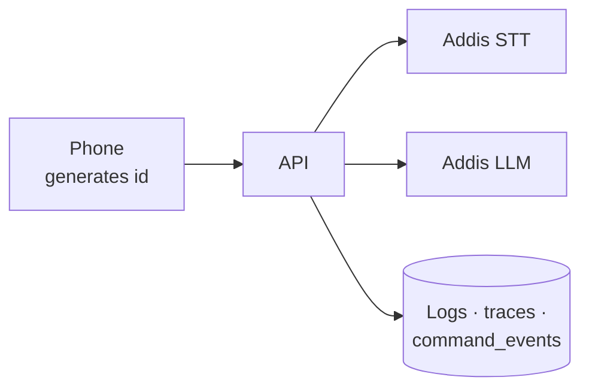

The system is a pipeline across two providers and a phone. **Without correlation, a slow command
cannot be attributed to anything.**

## Signals

| Signal | Content | Explicitly excluded |
| --- | --- | --- |
| Traces | One span per stage, request id propagated from the client | — |
| Metrics | Stage durations, outcome counts, confidence distribution, provider error rates | — |
| Logs | Structured: request id, user id, outcome, durations | Transcripts, audio, contact names, app names |
| Crash reports | Stack, device model, OS version, layer (JavaScript or Kotlin) | Screen content |

**The request id is generated on the phone and travels every hop.** "It was slow this morning"
becomes a trace lookup rather than a guess. The same id is the primary key of the
[`command_events`](/architecture/data/#command_events-in-detail) row.

## The logging rule

> **A log line never carries both a user identifier and anything the user said.**

That rule keeps a debugging convenience from becoming a surveillance database.

## SLOs and alerts

| SLO | Target | Alert |
| --- | --- | --- |
| Command success rate | 90% over 1 h | Page below 80% |
| p95 time to first audio | Under 6 s | Page above 8 s |
| API availability | 99.5% monthly | Page on probe failure |
| Provider error rate | Under 2% | Warn above 5% |

**Every alert names the degradation it corresponds to** in the
[failure table](/architecture/failure/#failure-table). An alert with no defined user impact is
noise.
