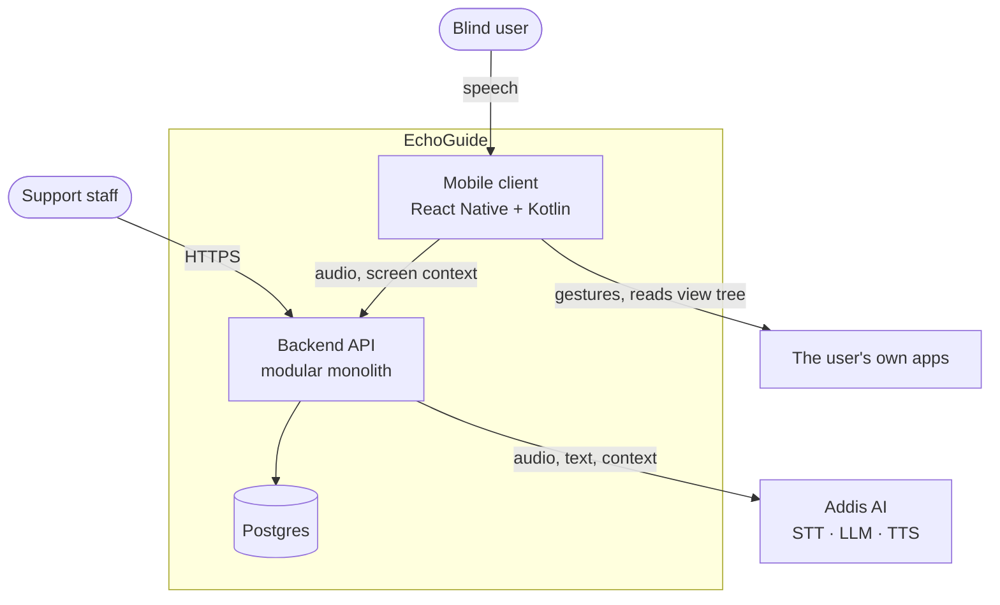

A blind user speaks a command. EchoGuide transcribes it, plans a sequence of interface actions,
and performs those actions inside the apps already on the phone. It ships bilingual, Amharic and
English.

:::note[Status of this section]
The Architecture pages document the **target design**, taken from the system architecture draft
dated 2026-09-17. The repository holds scaffolding for it. Where the code and the design differ,
the page says so.
:::

## Five components, five jobs

Each component has one input and one output, and no two overlap.

| Component | Input | Output | Runs on |
| --- | --- | --- | --- |
| Capture | Microphone | Audio buffer | Phone, Kotlin |
| Transcriber | Audio buffer | Text + confidence | Addis AI, proxied by the backend |
| Planner | Text + screen context | Structured action plan | Addis AI, proxied by the backend |
| Speech | Response text | Audio | Addis AI for Amharic, on-device for English |
| Executor | Action plan | Gestures in other apps | Phone, Kotlin accessibility service |

**That separation is the system's core asset.** A transcription fault reproduces from an audio
file alone — no phone, no screen state, no model reasoning in the loop.

## Context

Who touches the system, and what crosses each boundary.

**The phone holds no provider credential.** The backend is the only component with API keys.
That is also what makes per-user rate limiting and cost attribution possible.

## The voice platform

Addis AI supplies transcription, planning and speech synthesis. It is built for Amharic and
Afaan Oromo, which is why it was chosen over a general-purpose provider.

| Service | Use here | Stated capability |
| --- | --- | --- |
| Speech to text | Command transcription | 3% word error rate on Amharic |
| Text to speech | Spoken responses | 28 production voices, USD 0.032 per minute |
| Language model | Action planning | `Addis-፩-አሌፍ` |
| Realtime audio | Future pipeline | Speech in, speech out over one WebSocket — beta |

Three consequences follow.

**The largest product risk collapses.** A general speech model puts Amharic in its low-resource
tail. A vendor specialising in Amharic turns that open question into a measurement. The 3%
figure is the vendor's, so it is still verified against a local corpus — see
[Testing and layout](/architecture/testing/).

**One vendor, not two.** Transcription and planning share a provider, an account, a rate limit
and an outage. The code is simpler and the risk is concentrated. An outage is total loss of
function — see [Failure and degradation](/architecture/failure/).

**No Kotlin SDK exists.** The vendor ships JavaScript and Python SDKs plus a REST API. The
Android pipeline calls the backend and the backend calls the vendor — which the security model
requires anyway, since the phone must never hold a provider key.

The vendor endpoints are OpenAI-compatible, so an adapter written against that shape stays
portable if the vendor is ever replaced.

## Five drivers

Five constraints force the design. Changing one invalidates large parts of it.

| # | Driver | Consequence |
| --- | --- | --- |
| D1 | The executor drives **other applications** | Android `AccessibilityService`, which is Kotlin and cannot be JavaScript |
| D2 | Users cannot see the screen | Every state must be announceable; silence reads as a crash |
| D3 | Every command needs a network round trip | No offline mode until the planner runs locally |
| D4 | Audio is intimate by nature | Retention is opt-in; the default path persists nothing |
| D5 | Amharic is the primary language | Vendor chosen for Amharic; accuracy still verified locally |

D1 and D2 are permanent. D3 is expected to change. D4 is a commitment. D5 is why the design
names a vendor rather than a category.

## Quality targets

Targets, not aspirations. Each is measurable.

| Attribute | Target | Measured how |
| --- | --- | --- |
| Time to first audio | p50 under 3.5 s, p95 under 6 s | Client span, end of speech to first TTS byte |
| Time to acknowledgement | Under 400 ms | Spoken confirmation before the pipeline completes |
| Command success rate | Above 90% for English at launch | Executed plan matches intent, sampled by review |
| Transcription rejection rate | Below 8% | Confidence-gate rejections over total commands |
| API availability | 99.5% monthly | Synthetic probe against `/health` |
| Executor safety | Zero unintended destructive actions | Audit of executed plans against the allowlist |
| Cold start to listening | Under 2 s | First frame to wake word active |
| Crash-free sessions | Above 99.5% | Crash reporter |

**Executor safety is the only target with no acceptable non-zero value.** A misfire on a
banking app does more damage than a week of downtime.

## Reading order

Each page covers one part of the system.

1. [Mobile client](/architecture/mobile-client/) — the React Native and Kotlin split, and the one rule behind it
2. [Command pipeline](/architecture/command-pipeline/) — capture, confidence gate, speech, lifecycle
3. [Latency, cost, capacity](/architecture/performance/) — the budget and what it forces
4. [Backend](/architecture/backend/) — modular monolith, dependency rule, contracts
5. [Data](/architecture/data/) — schema, partitioning, consent, deletion
6. [Security](/architecture/security/) — why the primary threat is the system itself
7. [Failure and degradation](/architecture/failure/) — what the user hears when things break
8. [Observability](/architecture/observability/) — traces, SLOs, and what logs never contain
9. [Admin and docs clients](/architecture/other-clients/) — including voice on this site
10. [Testing and layout](/architecture/testing/) — test gates and repository structure
11. [Evolution](/architecture/evolution/) — the planned moves after launch
12. [Decisions and risks](/architecture/decisions/) — ADRs, risk register, open questions
