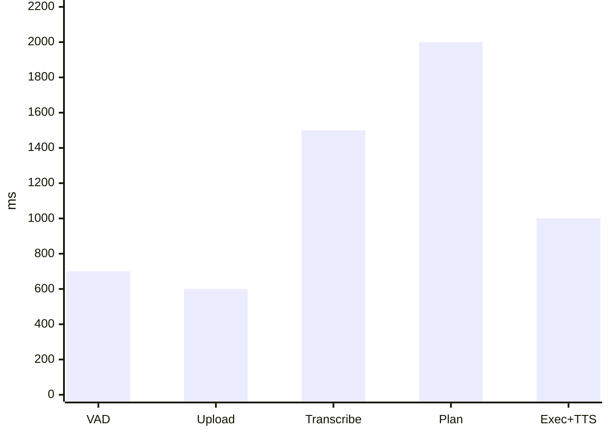

## Latency budget

Worst case per stage, in milliseconds.

| Stage | Worst case |
| --- | --- |
| VAD end-of-speech | 700 ms |
| Upload | 600 ms |
| Transcribe | 1 500 ms |
| Plan | 2 000 ms |
| Execute + TTS | 1 000 ms |
| **Total** | **5 800 ms** |

**The worst case totals 5.8 s against a 6 s p95 target. There is no slack.** Two consequences
follow:

- **Speak early.** The acknowledgement fires when the buffer closes, not when the plan returns.
- **Optimise planning.** It is the largest bar and the only one with architectural levers — prompt size, model choice, streaming, and caching of screen context.

Upload is already small. A 3-second 16 kHz mono buffer is roughly 96 KB. Move to a compressed
container only if field data shows upload dominating on metered connections.

The JavaScript bridge appears nowhere in this budget. That is the point of the
[mobile client rule](/architecture/mobile-client/#the-rule).

## Cost per command

Two metered services per command: transcription of the utterance, and synthesis of any Amharic
reply. Planning is billed per token and is the unknown.

| Line | Rate | Per command | Basis |
| --- | --- | --- | --- |
| Transcription | Per minute of audio | Unknown | A 3 s command is 0.05 minutes |
| Amharic synthesis | USD 0.032 per minute | ~USD 0.003 | A 5 s spoken reply is 0.083 minutes |
| Planning | Per token | Unknown | System prompt + screen context + command |

:::caution[Pricing is incomplete]
Only the synthesis rate is published in a usable form. Get transcription and model pricing from
the vendor before building any revenue model on these figures.
:::

**What can be said now.** Synthesis alone, at 30 commands a day with half in Amharic, is roughly
USD 1.35 per active user per month. That is the smaller of the three lines. Pricing the
subscription needs the other two.

**The lever if the number lands badly** is the split speech path. Pre-synthesised phrases cost
nothing, and they cover most of what the system says in a day.

## Capacity

| Measure | Value |
| --- | --- |
| Users | 10 000 |
| Commands per user per day | 30 |
| Commands per day | 300 000 |
| Average rate | ~3.5 requests per second |
| Peak rate | ~15 requests per second |
| Time each request is held | 2–4 s |
| In-flight at peak | ~60 |

Small numbers, unusual shape. Each request holds a connection for 2–4 seconds while waiting on
two upstream calls.

Concurrency is `peak rps × latency`, roughly 60 in-flight requests. Node handles that comfortably
**provided every upstream call has a hard timeout**. Without timeouts, one slow provider becomes
exhausted sockets and a dead API. The timeouts are listed in
[Failure and degradation](/architecture/failure/#resilience-mechanics).
