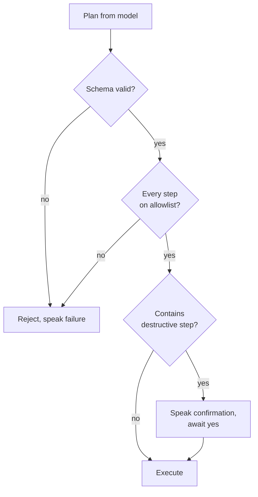

## The primary threat is the system itself

An application that can read any screen and tap any button is structurally indistinguishable
from malware. The only difference is intent. That shapes the threat model more than any external
attacker.

| Threat | Vector | Control |
| --- | --- | --- |
| Planner emits a harmful plan | Hallucination, or injection from on-screen text | Allowlist validation before execution; destructive steps need confirmation |
| Prompt injection via screen content | A message on screen instructs the planner | Screen context is data, never instruction; plan output is validated, never trusted |
| Credential capture | Microphone active on a password or payment field | Capture suspended by field type, before any request |
| Provider key extraction | Key shipped inside the app | Keys exist only on the backend |
| Session theft | Token copied to another device | Sessions bound to `install_id`; rotation on refresh |
| Bridge abuse | A compromised JavaScript bundle drives the executor | The bridge cannot request an action |
| Admin overreach | Support staff reading user data | Permission checks server-side; every action audited |
| Audio exfiltration | Retention without consent | Storage write gated by the `consent` module |

## Plan validation

The planner returns a structure. **The backend validates it before the phone sees it, and the
executor validates it again before acting.**



**Destructive means** sending money, deleting content, messaging a new recipient, changing a
system setting, or acting in an app the user has not granted.

The allowlist is a **per-app capability grant**, not a global boolean.

:::danger[Never skip validation]
A planning model with unchecked execution rights is remote code execution with extra steps.
Never execute a model-authored plan without validating it.
:::

## The bridge is not an execution path

React Native puts a JavaScript bundle into a process that can drive other apps. That bundle is
treated as untrusted.

- **The bridge exposes intent, never action.** JavaScript can ask the pipeline to start listening. It cannot ask the executor to tap a coordinate, open an app, or run a plan.
- **One source of plans.** The executor accepts plans only from the validated response of a command the pipeline itself started.
- **Validation lives in Kotlin.** A compromised bundle cannot weaken it.
- **No over-the-air bundle updates.** A remotely updatable JavaScript bundle inside an accessibility service is a supply-chain hole.

That last rule gives up React Native's headline advantage on purpose. It is the right trade in
an app with these permissions.

## Authentication

| Property | Choice | Reason |
| --- | --- | --- |
| Identity | Phone number, hashed at rest | Shared phones are normal; the hash still identifies an account |
| Session | Opaque token, server-side lookup | Revocable instantly; a JWT is not |
| Binding | Token bound to `install_id` | A stolen token is useless elsewhere |
| Rotation | New token on every refresh | Bounds the window of a leaked token |
| Admin | Separate credential, separate table, permission rows | An admin is not a user with a flag |

### Permissions are rows, not a boolean

```
users.read · users.suspend
consent.read · consent.revoke
telemetry.read · telemetry.export
billing.refund
admin.manage
```

`if (user.isAdmin)` has no answer to "which support agent may revoke consent but not suspend
accounts". Write the check once, in middleware, and make every admin route declare what it
needs.

## Platform review

Store policy restricts accessibility-service APIs to apps whose core function genuinely needs
them, and requires a declaration explaining that use.

EchoGuide qualifies on its merits, but **review is a real release gate, not a formality.** Verify
the current policy before first submission and give the declaration an owner. A rejection
discovered at launch costs weeks.
