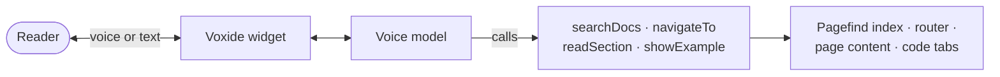

You can move around this documentation by speaking. The assistant can search the docs, open a
page, read the section you are on, and switch a code example to another language.

## Using it

The assistant sits at the bottom of every page. Open it and choose how to talk to it:

- **Voice** — speak, and it answers out loud. Your browser asks for microphone access the first time.
- **Text** — type instead, if you are somewhere you cannot speak.

Closing the panel releases the microphone.

**It keeps listening as you move between pages.** Opening a page by voice does not end the
conversation, so you can ask it to read what just opened.

## What it can do

It can do four things, and nothing else.

| Ask it to | It does |
| --- | --- |
| Find something | Searches the full text of the docs and tells you the best matches |
| Open a page | Goes to the page you name, in your own words |
| Read this | Reads the section you are currently on |
| Show an example in a language | Switches the code example to that language, on pages that have one |

Phrasing is up to you. There is no list of commands to learn — the same idea as EchoGuide
itself.

**It cannot change anything.** It only reads public documentation, so a misunderstanding costs
nothing more than landing on the wrong page.

:::note[If you do not see it]
The assistant only loads when the site has been configured with a Voxide key. Search by voice
works on the published site, not on a local development server.
:::

## How it is built

This part is for developers working on the docs site.

The assistant is built on [Voxide](https://www.npmjs.com/package/@voxide/react), a browser voice
SDK. It registers four functions with a live voice model, and the model decides when to call
them. The reasoning for adopting it here, and not yet in the admin portal, is in
[Admin and docs clients](/architecture/other-clients/#voice-navigation-on-this-site).

| Capability | Implementation |
| --- | --- |
| `searchDocs(query)` | Pagefind, top 5 results, markup stripped |
| `navigateTo(section)` | Fuzzy match over every docs route, then a client-side navigation |
| `readSection()` | The nearest `h2` above the scroll position, returned as text for the agent to speak |
| `showExample(language)` | Finds a matching code tab and selects it |

### Where it lives

| File | Role |
| --- | --- |
| `src/components/Footer.astro` | Mounts the assistant and passes it the list of routes |
| `src/components/Head.astro` | Adds `<ClientRouter />` so navigation does not reload the page |
| `src/components/assistant/Assistant.tsx` | Creates the client and registers the four capabilities |
| `src/components/assistant/capabilities.ts` | The four handlers |

**The session survives navigation** because of two things together: `<ClientRouter />`, and
`transition:persist` on the assistant island. Remove either and every page change starts a new
voice session, which breaks `readSection()`.

### Setup

1. Put the public key in `apps/docs/.env` as `PUBLIC_VOXIDE_KEY`. The variable is listed in `.env.example`.
2. Add the production domain to the domain whitelist in the Voxide dashboard. `localhost` is always allowed.
3. Run `npm run build` and `npm run preview` to test search. The Pagefind index only exists after a build.

Without a key the widget renders nothing. That is expected, not a bug.

:::caution[Do not call `init()`]
The widget initialises the client itself. Calling `client.init()` as well opens a second
session on every page load — and the SDK is metered.
:::
